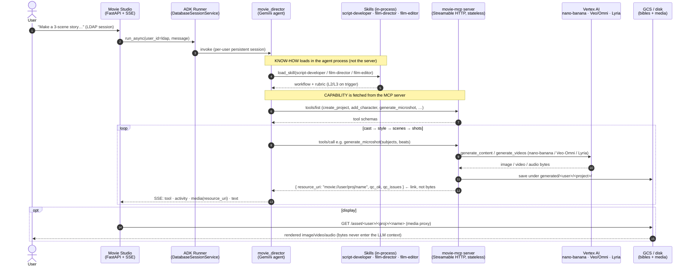

# 🎬 movie-studio-agent

An **AI film-production studio**: a Google **ADK director agent** (Gemini) that turns an idea into a
finished short — cast, style, storyboards, and video — by composing **Agent Skills** (the *know-how*)
with **MCP tools** (the credentialed *capability*) over Google **Vertex AI** models (nano-banana for
images, Veo/Omni for video, Lyria for music).

You talk to a director in a 3D chat UI; it casts characters, locks a look, storyboards each scene as a
3-panel "micro-shot," and animates them into ≤10 s clips — reviewing its own output and regenerating
what's wrong. You can also **upload your own characters/props**, change wardrobe, and it keeps
per-user, persistent sessions.

```
movie/          movie-mcp — the MCP server + pipeline (story bible, film grammar, image/video/music, editor QC)
movie_agent/    the ADK "movie_director" agent (Gemini) — Skills + MCP toolset
movie_studio/   FastAPI 3D chat UI — SSE chat, activity panel, media proxy, uploads, per-LDAP persistence
cloudbuild.*    Cloud Build configs for the two repo-root-context images
```

---

## 1. What is this? (blog / docs)

The design story — why an agent + Skills + MCP, the "pre-production barrier," and the moat — is written
up as a blog, **bundled in this repo** (`docs/`) so it renders on GitHub with no external hosting:

- **[Agentic studio series](docs/agentic-studio-series.md)** — the overview of this project.
- **[Part 1 — the thesis](docs/part-1-thesis.md)** — why an agentic studio, and the bet.
- **[Part 3 — the moat](docs/part-3-moat.md)** — what's defensible.
- **[The pre-production barrier](docs/pre-production-barrier.md)** — the problem this solves.
- **[MCP & Skills primer](docs/mcp-and-skills.md)** — the two standards, for leaders then builders.

> These links are relative Markdown files in this repo — click them right here on GitHub. (The same
> posts are also published as HTML in the companion [`learn-mcp`](https://github.com/gauravz7/learn-mcp)
> repo's GitHub Pages, once that site rebuilds.)

---

## 2. How ADK interacts with Skills and MCP servers

The **agent runtime (ADK)** holds two kinds of tools. **Skills** run *inside* the agent process
(progressive disclosure — only ~metadata resident until triggered) and decide *how*. **MCP tools**
are fetched from the **movie-mcp server** over Streamable HTTP and supply the credentialed *what*
(the Vertex model calls). The LLM is the glue; only small `movie://` links cross back — never bytes.



**The split in one line:** *Skills decide how; MCP tools do what; the agent orchestrates; links (not
pixels) flow back.* Swap the host (ADK → Claude, etc.) and the MCP capability layer is unchanged — the
`SKILL.md` files are an open, cross-runtime spec.

---

## 3. Design decisions

- **Links, not bytes.** Tools return a `movie://<user>/<project>/<name>` URI; bytes are read on demand
  by the UI's media proxy. Megabytes never enter the model's context. (`_asset_uri`, `read_asset`.)
- **Skills (know-how) vs MCP tools (capability).** Workflow/judgment lives in `SKILL.md`
  (`script-developer` clarifies + gates, `film-director` plans shots, `film-editor` reviews quality);
  the credentialed Vertex calls live behind MCP tools. Clean seam, independently swappable.
- **Per-user "story bible."** `movie_store` is strictly partitioned by `user_id` (atomic JSON writes,
  path-sanitized) — every user's projects, characters, scenes, shots, and media are isolated.
- **Validation gate before pixels.** `plan_scene` runs a pure-logic `film_grammar` validator (180°
  line, eyeline, 30°, establish-first, lens) and persists a plan **only if error-free** — you catch
  continuity mistakes before spending a single render.
- **Identity is anchored, not re-described.** Each character has a canonical **reference sheet**; every
  shot composites from it. Wardrobe/appearance is *locked to the sheet*, so changing an outfit means
  re-styling the sheet (`update_character`), not tweaking a scene prompt.
- **Scene cast = who's *present*, not who *speaks*.** Resolved from `subjects` / blocking / beats;
  a silent character stays in frame, and other characters are excluded (no accidental cameos in video).
- **Self-reviewing pipeline.** A vision **editor critic** scores each render against the references and
  regenerates *with the critic's feedback fed back in* (not a blind re-roll).
- **Stateless MCP for Cloud Run.** `movie-mcp` runs `stateless_http` so autoscaling/cold starts can't
  drop a session (which otherwise empties the agent's toolset).
- **Persistent, multi-user sessions.** The UI keys sessions by LDAP via ADK `DatabaseSessionService`
  (SQLite locally; point at Cloud SQL for multi-instance) — returning users see prior work + generations.

---

## 4. Where the magic happens

| Magic | File · function |
|---|---|
| **Iterative keyframe composition** — insert characters **one at a time** onto the styled plate (≤2 refs/call) so the model never drops/blends identities | `movie/movie_server.py` · `mv_generate_shot` |
| **3-panel micro-shot → one continuous clip** — the storyboard strip + character sheets + plate are fed as *reference-to-video* (Omni), split across the 10 s | `mv_generate_microshot` → `videogen.start_reference_video` |
| **Editor QC feedback loop** — render → vision critic (identity/style/anatomy/framing) → regenerate with the fix | `movie/imagegen.py` · `review_image`; loops in `mv_generate_shot` / `mv_generate_microshot` |
| **Film-grammar gate** — pure logic, no I/O, refuses bad plans | `movie/film_grammar.py` · `validate_plan` |
| **Wardrobe re-style keeping identity** — edits the reference sheet, not the scene | `mv_update_character` |
| **Bring-your-own + replace-on-upload** — an upload with a matching name replaces that character/prop | `mv_import_character` / `mv_import_prop`; UI `POST /upload` |
| **Dynamic per-user identity** — the director's `user_id` is injected from the session (LDAP) at runtime | `movie_agent/agent.py` · `_instruction` (InstructionProvider) |
| **Live "how it's thinking" panel** — streams tool calls, skills, results, QC verdicts over SSE | `movie_studio/app.py` · `_run_turn`; `static/app.js` activity tab |
| **Content-filter-safe prompting** — illustration framing, generic adult descriptions, no IP names | image prompts throughout `movie_server.py` |

---

## 5. Deploy — what can people run this with?

**You need:** a Google Cloud project with **Vertex AI** enabled, [`uv`](https://docs.astral.sh/uv/) +
Python 3.11+, and (for cloud) the `gcloud` CLI + Docker. Auth is **Application Default Credentials**
(`gcloud auth application-default login`) — no keys in the repo.

**Models it drives (all Vertex):** `nano-banana` (Gemini image, e.g. `gemini-3.1-flash-image`) for
sheets/plates/keyframes/storyboards; **Veo** / **Gemini-Omni** for video (≤10 s clips); **Lyria** for
music; and a Gemini text model for the **director** and the **QC critic** (`$QC_MODEL`).

### Run locally
```bash
# 1) MCP server
cd movie && GOOGLE_CLOUD_PROJECT=<proj> uv run python movie_server.py --http --port 9100
# 2) Studio UI  → http://localhost:8090
GOOGLE_CLOUD_PROJECT=<proj> uv run --project movie_studio python movie_studio/app.py
# (optional) the director in adk web
cd movie_agent && MCP_URL=http://localhost:9100/mcp uv run python run.py "A 2-scene story about a lighthouse keeper"

# pure logic, no cloud creds:
cd movie && uv run python film_grammar.py     # validator demo
cd movie && uv run python movie_store.py       # store + isolation smoke test
```

### Deploy to Cloud Run (3 services + shared media bucket)
```bash
export PROJECT=<proj> REGION=us-central1 BUCKET=gs://$PROJECT-movie-studio
gcloud services enable run.googleapis.com cloudbuild.googleapis.com artifactregistry.googleapis.com storage.googleapis.com aiplatform.googleapis.com
gcloud storage buckets create $BUCKET --location=$REGION
gcloud artifacts repositories create mcp --repository-format=docker --location=$REGION
# grant the Cloud Run runtime SA objectAdmin on $BUCKET + aiplatform.user (see blog for details)

# movie-mcp (has movie/Dockerfile) — mount the bucket for durable bibles + media
gcloud run deploy movie-mcp --source movie/ --region $REGION --execution-environment=gen2 \
  --add-volume=name=state,type=cloud-storage,bucket=$PROJECT-movie-studio \
  --add-volume-mount=volume=state,mount-path=/mnt/state \
  --set-env-vars=MOVIE_GEN_ROOT=/mnt/state/generated,MOVIE_DATA_ROOT=/mnt/state/data,GOOGLE_CLOUD_PROJECT=$PROJECT,GOOGLE_CLOUD_LOCATION=global
export MCP=$(gcloud run services describe movie-mcp --region $REGION --format='value(status.url)')

# movie-studio (builds from repo root via cloudbuild.studio.yaml → deploy the image)
gcloud builds submit --config cloudbuild.studio.yaml --substitutions _IMAGE=$REGION-docker.pkg.dev/$PROJECT/mcp/movie-studio:latest .
gcloud run deploy movie-studio --image $REGION-docker.pkg.dev/$PROJECT/mcp/movie-studio:latest --region $REGION \
  --execution-environment=gen2 --add-volume=name=state,type=cloud-storage,bucket=$PROJECT-movie-studio \
  --add-volume-mount=volume=state,mount-path=/mnt/state \
  --set-env-vars=MCP_URL=$MCP/mcp,MCP_AUDIENCE=$MCP,MOVIE_GEN_ROOT=/mnt/state/generated,GOOGLE_CLOUD_PROJECT=$PROJECT,GOOGLE_CLOUD_LOCATION=global,GOOGLE_GENAI_USE_VERTEXAI=TRUE
```
`cloudbuild.adkweb.yaml` + `movie_agent/Dockerfile` deploy the optional `adk web` harness the same way.

**Notes for real deployments:**
- The two UIs mount the **same GCS bucket** so the studio serves the exact media movie-mcp generated,
  and bibles survive restarts.
- `movie-mcp` is **stateless** — safe to autoscale. The bottleneck is usually **Vertex model quota**,
  not the server.
- For durable login sessions across instances, set `SESSION_DB_URL` to Cloud SQL/Postgres (SQLite is
  single-instance).
- These services **bill Vertex on use** (Veo video is the pricey one) — cap with `--max-instances` and
  tear down when idle.

## Configuration knobs
`NANO_BANANA_MODEL`, `HIFI_IMAGE_MODEL`, `QC_MODEL`, `QC_MAX_TRIES`, `VEO_MODEL`/`OMNI_MODEL`,
`VEO_LOCATION`/`OMNI_LOCATION`, `MCP_URL`, `MCP_AUDIENCE`, `SESSION_DB_URL`, `MOVIE_GEN_ROOT`,
`MOVIE_DATA_ROOT`, `LOG_LEVEL`.
