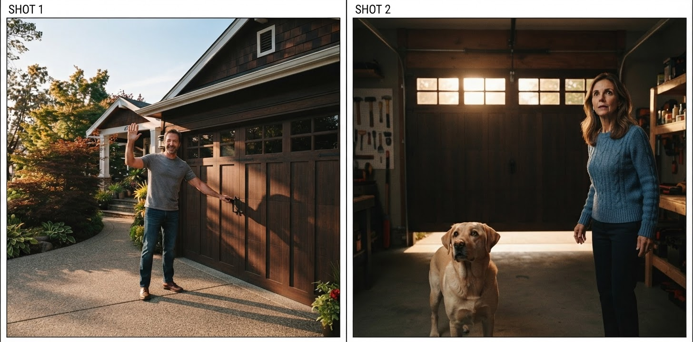
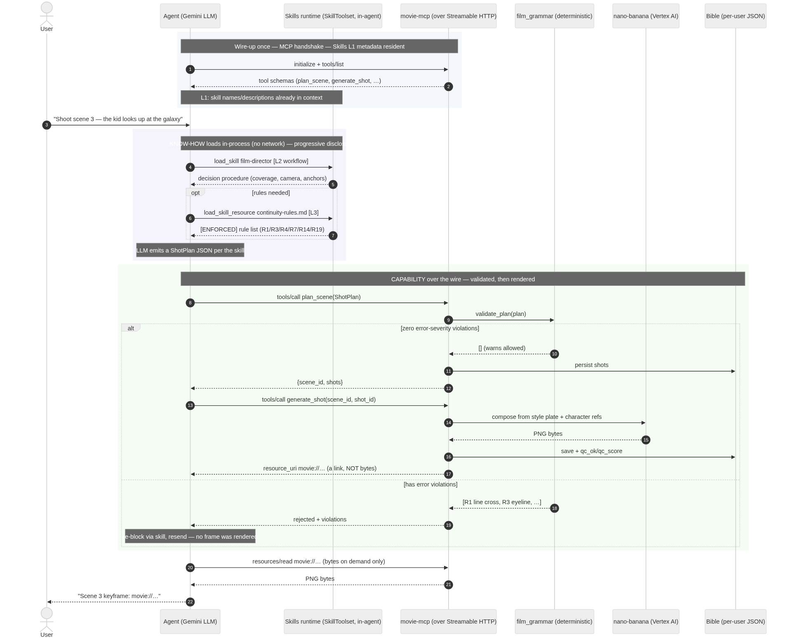
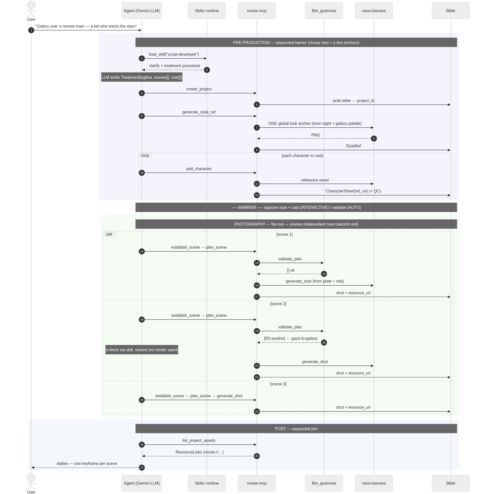

# MCP and Skills: the two standards behind an agentic studio

*The foundational piece of **[The Agentic Studio](agentic-studio-series.md)**. Half theory, half
field notes from building a real film-production agent — one that turns a sentence into a multi-scene
short. What MCP and Skills each are, why you need **both**, and the hard-won details that only surface
once you ship.*

---

## The one-paragraph version

A frontier model is a brilliant generalist with **no hands and no training manual**. To do real work
it needs two things it can't get from being bigger: **capability** it doesn't own — credentialed
image/video/audio models, databases, other people's APIs — and **craft**, the domain know-how for
*how* to use that capability well. **MCP (Model Context Protocol)** standardizes the first: a wire
protocol that exposes any capability as typed tools an agent can call. **Agent Skills** standardize
the second: versioned `SKILL.md` folders the agent loads on demand, carrying the procedure and the
rules. **MCP is the *what*; Skills are the *how*; the LLM is the glue.** This post is how they fit —
and what building a studio out of them actually taught me.

## The analogy: a film set

Picture a film set. Two very different things make it work.

First, **the equipment and the power that runs it** — cameras, lights, the grip truck, and the
standardized sockets everything plugs into. Any operator can walk up, plug in, and get power without
knowing how the generator works or where the electricity is billed. That's **MCP**: a *standard
socket for capability*. The movie server exposes "generate an image," "animate a scene," "score this"
as uniform tool calls. The credential — who pays Google for the render — lives on the server; the
agent just plugs in.

Second, **the department heads' craft** — the cinematographer who knows which lens sells intimacy,
the script supervisor who guards the 180° line, the editor who calls for another take. None of that is
equipment. It's *knowledge about how to use the equipment*. That's **Skills**: portable playbooks the
agent opens when the task calls for them.

The **director** — the LLM agent — doesn't personally operate the camera or hold the continuity
notes. It **coordinates**: reads the brief, consults the right playbook, calls the right capability. A
film crew is a distributed system that predates computers; MCP + Skills is that same org chart,
re-implemented for an agent.

> A better *model* is a better director. It still needs the crew (Skills) and the gear (MCP). Scaling
> the director alone doesn't get you a studio.

## Why a wire protocol at all? (REST vs MCP vs Skills)

Three ways to give an agent more reach. They're constantly conflated, but they sit at **different
layers and compose** — they aren't rivals:

- **A plain REST API** is *the app calls a service.* It isn't agent-aware: every app that wants its
  LLM to use the endpoint writes its own glue to describe the tool and translate the model's
  tool-calls into HTTP. You can move that glue around; you can't delete it.
- **An MCP server** is *the agent calls a service.* Now the glue *is* the standard — discovery, typed
  tools, structured I/O, even server→client requests come built in. Write the server once and every
  MCP host (a Gemini agent, Claude Desktop, an IDE) uses it with no per-app integration.
- **A Skill** is *the agent gains know-how it runs itself,* inside its own runtime — no server, no
  network hop.

The one-line split: **MCP adds *connections* (to external systems); Skills add *procedures* (how to
do something well).** They compose — a Skill's instructions can say "call `generate_image`," and that
tool lives on an MCP server. And the dividing line that never moves is **where the code runs**: the
Skill executes *in the agent*, the tool executes *on the server*. Wire them together; don't merge them.

Rule of thumb: one tool in one app you own → just hardcode the API call. The moment a capability must
be **reused across apps, shared, credentialed, or discovered at runtime** → MCP earns its keep.

## What it looks like in practice

Three concrete moments from the studio behind ***The Choice*** — a 4-scene photorealistic short the
system produced end to end. Every one of them inherits a single **style anchor**, generated first so
the whole film shares one look:

**1. Capability (MCP).** "Cast Arthur." The agent calls one tool, `add_character`. The server runs
nano-banana on Vertex, saves a canonical reference sheet, and returns a tiny record — a `movie://`
link, not a megabyte of pixels. The whole cast, anchored the same way — each a reusable sheet the
render conditions on, never re-described from scratch:

<figure><figcaption>Arthur</figcaption></figure>
<figure><figcaption>Martha</figcaption></figure>
<figure><figcaption>Buddy</figcaption></figure>

**2. Craft (Skills) → capability (MCP).** "Shoot scene 1." The `film-director` skill decides the
coverage and continuity (a wide, a close, the reverse; hold the eyeline); the agent then calls
`generate_microshot` for the storyboard and `start_scene_video` to animate it.

<video controls preload="metadata" src="media/choice-scene-1.mp4" style="width:100%"></video>

**3. The wiring.** Skills load *inside* the agent (no network); MCP tools are fetched from the server
over the wire. Only small links cross back — the pixels are read on demand.

That's the whole shape. Now the depth, one layer at a time.

---

## Layer 1 — MCP: capability on a wire

MCP is a client/server protocol built on **JSON-RPC 2.0**. Your agent (the *host*) runs a **client**;
each capability provider is a **server**. A server only ever sees its own small conversation — never
your whole chat, never the other servers — so isolation is structural, not a policy you enforce. A
server advertises three kinds of things, split by **who decides to use each**:

- **Tools** — the **model** decides to call them (typed functions, like `generate_image`).
- **Resources** — the **app** decides to read them (addressable blobs, like `movie://user/project/frame.png`).
- **Prompts** — the **user** decides to run them (parameterized templates — think slash commands).

### The handshake: protocol + capability negotiation

A connection opens with a negotiation, not an assumption:

1. The client sends **`initialize`** carrying the **protocol version** it speaks and the
   **capabilities** it offers (sampling, elicitation, roots…).
2. The server replies with the version they'll actually use — they settle on a common one, so you
   *trust the handshake, not a hardcoded constant* (ours negotiated `2025-11-25`) — plus **its**
   capabilities (tools, resources, prompts, and whether each can emit `list_changed`).
3. The client sends **`notifications/initialized`**, and the session is live.

This matters because features are **conditional**. Server-to-client calls like *sampling* (the server
borrows the host's LLM to think) and *elicitation* (the server asks the user for structured input)
only work if the client advertised them at handshake. A well-built tool checks and **degrades
gracefully** — a "caption this image" tool that uses sampling falls back to a plain response against a
client that never offered it. Capability negotiation is exactly why one server behaves correctly
against a full desktop host *and* a bare headless agent.

### Discovery: the agent learns the toolset at runtime

Nothing is hardcoded on the client. After the handshake it asks:

- `tools/list` → tool names + **JSON-schema for inputs *and* outputs**,
- `resources/list` and `resources/templates/list` → readable blobs and URI templates,
- `prompts/list` → user-invokable templates.

So adding a tool on the server surfaces it to *every* client with no client change — this is the
**M×N → M+N** collapse: build a capability once, every agent discovers it. Servers can also emit
`notifications/tools/list_changed` so a long-lived client re-discovers a toolset that changed
mid-session.

### Transports: stdio vs Streamable HTTP

The protocol is transport-agnostic; two carry it in practice:

- **stdio** — the server is a **subprocess**; messages flow over stdin/stdout pipes. No network, one
  server per client — ideal for local dev, desktop hosts, and CLI tools.
- **Streamable HTTP** — the server is a **network service** over HTTPS. "Streamable" means it can push
  messages back on an open connection via **Server-Sent Events (SSE)** — which is what carries
  progress notifications and server-initiated calls. This is how you run on Cloud Run or behind a load
  balancer.

Switching between them is a one-line change on the client (`StdioConnectionParams` →
`StreamableHTTPConnectionParams`); the server code is identical.

### Sessions: stateful vs stateless

Over HTTP, MCP runs **stateful** or **stateless**:

- **Stateful** — at `initialize` the server issues an **`Mcp-Session-Id`**; the client echoes it on
  every request and the server keeps per-session state on one instance. This is what makes the live
  server→client callbacks (progress, sampling, elicitation) possible — they need an open channel.
- **Stateless** — no session id, every request self-contained. You give up the live-callback trio but
  gain trivial horizontal scale: any instance can serve any request.

The trade-off is real and it bit me. A **stateful** server behind an **autoscaling** platform loses
its session on a cold start or a new instance, and the client silently gets an **empty toolset** —
which the agent then reports as "tool not found." For serverless request/response tools, run
**stateless** (`stateless_http`) and the whole class of bug disappears.

### The load-bearing idea: links, not bytes

An image tool does *not* return base64. It saves the PNG server-side and returns a ~100-token record
with a `movie://` URI. The bytes travel to the client only on an explicit `resources/read`, and enter
the *model's* context only if the host deliberately feeds them in (e.g. a vision critic). Why it's the
whole ballgame: the studio fans a scene out to several parallel branches, each needing a few reference
images. As links that's a few hundred tokens; as inlined base64 it melts the context window and the
fan-out stops being affordable. **The economics of parallelism live in this one decision.**

A few more mechanics that earn their keep:

- **Per-call model selection.** Type the `model` parameter as an enum in the schema and the agent
  picks the right tier per call (fast draft vs. high-fidelity). Adding a model is a one-line change.
- **Structured output.** Tools return typed records (a Pydantic model → `outputSchema`), so the agent
  gets `qc_ok`, `qc_issues`, `resource_uri` as *data*, not a paragraph.
- **Errors as data.** Raise inside a tool and MCP surfaces `isError: true` with a message the model
  can read and react to — a missing source image becomes "regenerate," not a crash. (A *broken call* —
  unknown tool, bad args — is still a hard JSON-RPC error; a *logic* failure is `isError` so the
  conversation continues.)

### Credentials live on the server — and stay there

Because the capability lives behind the server, so does the credential to run it. The agent never
holds the Vertex key; it just calls `generate_image`, and the *server* authenticates to the model
under its **own** identity (a workload identity — no key file baked into the image). That's the
centralization the film-set analogy promised: the grip truck is wired to the generator; the operator
just plugs in.

Two independent boundaries fall out, and they must never mix:

1. **Who may use the capability** — enforced at the server's front door (OAuth / platform IAM).
2. **Whether the server may call the model** — the server's own downstream identity.

The cardinal rule: **never pass the user's token through to the model API.** Minting the downstream
call under the *server's* identity, not the caller's, is what avoids the classic *confused-deputy*
leak — and it's why a single audited server, not every client, is where secrets and quota belong.

### Scaling: the bottleneck isn't your server

At thousands of concurrent users the constraint is almost never the MCP server — it's **model quota**.
Concurrent generation calls `429`, and cost scales linearly with usage, not with how clever the
protocol is. Design for that reality:

- **Stateless HTTP** so the service scales horizontally like any stateless web app.
- **Object storage** (GCS/S3) for artifacts, served by signed URLs — the per-instance filesystem is
  ephemeral and unshared, so never treat local disk as the store of record.
- **Per-user rate limits** against a quota you sized on purpose, so one user can't exhaust the pool.
- **Per-call model selection** and **prompt caching** to keep the one cost that actually dominates —
  the work itself — in check. (Caching also narrows the input-token gap that always-resident tool
  schemas create.)

The server is cheap to scale; the render function is what you budget for.

### A few more field notes

- **Timeouts.** Image generation is ~12 s; the default MCP tool timeout in some clients is 5 s. Set it
  generously (the studio uses 120–180 s) or every render "fails" spuriously.
- **Treat third-party tool metadata as untrusted.** A server you don't control can smuggle
  instructions into a tool's description (prompt-injection). Vet a server before you connect it,
  exactly as you'd vet a dependency — the protocol can't enforce this for you; a good host asks for
  consent, but the trust decision is yours.
- **DNS-rebinding protection.** Behind a `*.run.app` host, a server's default localhost-only host
  allowlist rejects every request (HTTP 421) — and, like the stateful-session trap above, it surfaces
  as an *empty toolset*. Disable that specific check when the platform (Cloud Run + IAM) is your real
  security boundary. Two very different causes, one identical symptom — worth knowing before you hit
  it.

---

## Layer 2 — Skills: craft, in the agent's head

A **Skill** is a folder with a `SKILL.md`: a short spec of a workflow, plus optional reference files.
It runs *inside the agent's own runtime* — no server, no network. `SKILL.md` is an **open,
cross-runtime spec** (Claude and Google's ADK both consume the same file), so craft you write once is
portable across hosts.

The mechanism that makes Skills cheap is **progressive disclosure**, three levels:

- **L1** — the skill's name + one-line description. Always resident. Costs ~a line of context.
- **L2** — the full workflow. Loaded only when the task triggers the skill.
- **L3** — deep references (e.g. the continuity-rule tables). Pulled only when L2 points to them.

So a studio can carry a `script-developer`, a `film-director`, and a `film-editor` skill and pay
almost nothing for the ones not currently firing — like a well-indexed manual whose table of contents
stays on the desk while the chapters stay on the shelf until needed.

### The numbers (measured on this studio's three skills)

This isn't hand-waving — here is the actual context cost of the three skills in this repo (words → tokens
at the usual ≈1.3 tokens/word):

| What's loaded | Words | ≈ Tokens | When it's paid |
|---|---|---|---|
| **L1** — three skills' one-line descriptions | ~90 | **~120** | *every turn* (resident) |
| **L2** — one skill's full workflow | ~500 | ~650 | only when that skill fires |
| **L3** — that skill's reference tables | up to ~1,200 | up to ~1,550 | only when L2 drills in |
| **Naïve baseline** — all craft inlined in the system prompt | ~3,500 | **~4,600** | *every turn* |

Read the two bold rows against each other. Progressive disclosure keeps **~120 tokens** resident
instead of the **~4,600** you'd pay by stuffing every workflow and rule table into one system prompt —
a **~38× reduction in always-on context**, on every single turn, before the model has done any work.
The full craft is still *available*; it just isn't *resident*. When the director actually needs the
continuity rules, it pays ~2,200 tokens to open that one skill to L3 — for that turn, for that skill,
and nothing for the other two.

Two properties make this scale where a monolithic prompt doesn't:

- **The resident cost is O(number of skills' one-liners), not O(total craft).** Adding a fourth skill
  costs **~40 tokens** resident (its description), not the ~1,000+ tokens of its body. Ten skills is
  still only a few hundred resident tokens; ten skills inlined is a ~15k-token tax on every turn.
- **The expensive part is paid on demand and released.** A monolithic prompt pays for the 180°-line
  tables on the turn you write dialogue and on the turn you do nothing — identically. Skills pay only
  when the rule is about to be used, which is a tiny fraction of turns.

The context you *don't* spend on dormant instructions is context left for the actual task — the story,
the shot history, the critic's feedback. On a long multi-scene run that headroom is the difference
between the agent remembering scene 1 by the time it plans scene 4 and quietly forgetting it.

### The same law governs capabilities, too

Skills aren't the only thing competing for the window — **MCP tool schemas are resident every turn as
well.** A host lists a server's tools once and keeps every schema in context whether or not the turn
uses it (in the sibling `learn-mcp` server, 9 tools ≈ **2,040 tokens, always on**; a single
richly-typed tool with an `outputSchema` can be ~640 by itself). So the real scaling law is about
**resident vs on-demand**, and it cuts the same way for tools as for craft:

- **Capabilities (MCP/REST): O(N) always-on** — every schema you expose is paid on every turn.
- **Skills: O(N) tiny pointers + O(1) on-demand detail** — N one-liners resident; one body loaded
  when it fires.

Play it forward (≈4 chars/token, measured on this repo's servers):

| Capabilities / skills | All schemas resident (MCP/REST) | Skills (metadata + 1 loaded) | Context saved |
|---|---|---|---|
| 5   | ~1,130  | ~380   | ~66% |
| 50  | ~11,300 | ~2,330 | ~79% |
| 100 | ~22,600 | ~4,500 | ~80% |

Resident context is re-paid on **every turn of every session**, so it becomes money. At 50
capabilities, 20-turn sessions, an illustrative $0.30 / 1M input tokens: all-resident ≈
**$0.068/session** vs progressively disclosed ≈ **$0.014** — about **5×**, or roughly **$68k vs $14k
per million sessions** from capability-context alone.

Three honest caveats so this isn't oversold: it's only the *capability-context* cost — **the inference
cost of the actual work (each generated image) is identical** whichever way you wire it; **prompt
caching** discounts stable resident context to roughly a tenth when enabled; and MCP has its own
levers (tool filtering, fewer servers). The axis that matters is resident-vs-on-demand, not one vendor
against another.

The division of labor is the point: **a Skill decides *how*; it calls an MCP tool for the *what*.**
The `film-director` skill holds the decision procedure (map emotion → lens, keep the 180° line) and
emits a shot plan; the *rendering* is an MCP call. Swap the render backend and the craft is untouched;
rewrite the craft and the capability is untouched. Clean seam.

Why this beats stuffing everything into one giant system prompt: the know-how stays **modular,
versioned, and mostly out of context**. You can diff a skill, reuse it across agents, and add a fourth
without re-reading the other three on every turn.

---

## Layer 3 — Composition: how the studio is assembled

An ADK agent (Gemini) is handed two toolsets: a `SkillToolset` (the skills) and an `McpToolset` (the
movie server over HTTP). The LLM orchestrates; four structural pieces do the heavy lifting.

- **A typed state store — the "bible."** One JSON document per user/project. Every stage reads the
  previous stage's output *from the bible*, never from chat history. **The handoff artifact is the
  interface** — the same discipline as passing typed messages between services instead of sharing
  mutable memory.
- **A dependency-ordered pipeline with a barrier.** `create_project → generate_style_ref →
  add_character` is a *sequential barrier*: look and cast lock first. After it, scenes are independent
  and **fan out in parallel**. Barrier → fan-out → join, dictated by the data, not chosen for style.
- **Two judges.** A **deterministic gate** — a pure-logic function — checks the shot plan against
  continuity rules (open on a wide first, don't cross the 180° line, match eyelines, move the camera
  enough to avoid a jump cut) and refuses to save a plan that breaks them, *before a single
  GPU-second*. An **LLM critic** then scores each finished render against the reference sheets and
  **regenerates with its own feedback fed back in**, bounded by a retry ceiling. *Deterministic for
  what a rule can prove; a model for what needs judgment.*
- **Identity, anchored.** Each character is composited into every shot *from its reference sheet*, one
  at a time. Identity isn't re-described in a prompt; it's re-fed as an image.

The result is a film where the same face, set, and light hold across scenes:

<figure><video controls preload="metadata" src="media/choice-scene-2.mp4"></video><figcaption>Scene 2</figcaption></figure>
<figure><video controls preload="metadata" src="media/choice-scene-3.mp4"></video><figcaption>Scene 3</figcaption></figure>
<figure><video controls preload="metadata" src="media/choice-scene-4.mp4"></video><figcaption>Scene 4</figcaption></figure>

---

## The lessons that only show up when you ship

The theory above is clean. Shipping taught the corollaries:

- **Links, not bytes — or the context melts.** Every "return the asset" instinct is wrong; return a
  handle. This is what makes the parallel fan-out affordable.
- **Stateless on serverless, or the toolset silently empties.** The scariest bugs weren't crashes —
  they were the agent quietly losing its tools and improvising.
- **Wardrobe lives in the reference sheet, not the prompt.** Every shot is composited *from* a
  character's stored reference sheet — an image — so the render copies whatever that sheet shows.
  Typing "now in a blue dress" into the *scene* prompt does nothing: the sheet still shows the old
  outfit, and the sheet wins. To actually change a look you edit the **anchor** itself — re-style the
  reference sheet, save it, then re-render the shots from the new sheet. A character's appearance is a
  stored artifact you *edit*, not a sentence you *rewrite per scene*.
- **Compose identity one character at a time.** Keyframes are built by editing characters into the
  empty set plate one by one, with at most ~2 reference images per model call. It is tempting to pass
  every sheet at once ("here are five characters, put them in the room") — but when you do, the model
  reliably **drops someone or invents a stranger**. Feeding one identity per call, ≤2 references in
  play, is what keeps every character both *present* and *recognizable*. The constraint reads like an
  inefficiency; it's the thing that makes multi-character shots work at all.
- **Progressive disclosure keeps know-how ~free until it fires.** Each dormant skill costs ~a line of
  context, so you can carry many and pay for a skill's full workflow only in the turns it actually runs
  (the ~38× resident-context saving measured above). More craft doesn't mean a heavier every-turn
  prompt — which is exactly what lets the studio keep growing its playbook.

None of these are model problems. They're **state, ordering, and validation** problems — which is the
whole thesis: the durable, defensible layer is the *orchestrator*, and MCP + Skills are the two
standards that let you build it without owning the render function.

**The whole thing, end to end** — a sentence in, a multi-scene short out:

<video controls preload="metadata" src="media/studio-walkthrough.mp4" style="width:100%"></video>

---

*Read the series: **[The Agentic Studio](agentic-studio-series.md)** ·
**[Part 1 — the thesis](part-1-thesis.md)** ·
**[Part 2 — the architecture](pre-production-barrier.md)** ·
**[Part 3 — the moat](part-3-moat.md)**.*
