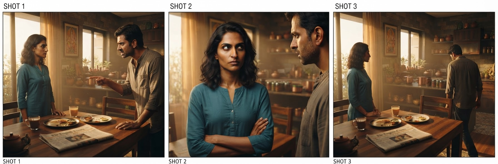

# Part 1 · The Studio Is a Distributed System

*Part 1 of **[The Agentic Studio](agentic-studio-series.md)**. The disruption in multimedia is not
a better render function. It is the coordination layer around one — the scheduler, the state store,
and the invariants that force N stochastic outputs to agree. This part is the argument for why that
layer is an agent, and why it is buildable now.*

---

## The category error

Every "AI video" launch is a better **render function**: `prompt → asset`. One call, one output, no
memory of the last output or obligation to the next. That curve is real and it is steep.

It is also solving the wrong problem. A film is not an asset; it is **a set of assets under a
consistency constraint**. The same face across 40 shots. The same set geometry from three angles.
The same key light, the same screen direction, cut after cut. The value — and the difficulty — is not
in any single frame. It is in the *agreement between frames*.

You have seen what happens when that agreement breaks, because it makes the blooper reels. The coffee
cup left on the table in a medieval fantasy series. The glass that's full, then empty, then full
again across a single conversation. A character looking screen-left, then — after the cut —
inexplicably screen-right, so the two people in the scene seem to have swapped seats. (That last one
has a name: crossing the *180° line*, the invisible line between two actors that the camera must stay
on one side of, or they flip sides on screen and the audience feels lost without knowing why.) Now
add the failure unique to generative models: ask one for "the same character" twice and you get two
subtly different people, because it has no memory of the last frame and no obligation to the next —
like a film where the lead is recast, slightly, in every scene. Every individual frame can be
flawless and the movie still falls apart.

*The opposite of a blooper: three shots the studio produced for a single scene — a wide two-shot, her
close-up, then the reverse angle. Same two people, same room, same wardrobe, same light, consistent
screen direction. This agreement between frames is precisely what a stand-alone render can't give you,
and precisely what the rest of this series is about producing on purpose.*

> **Improving the render function makes each frame better in isolation. It does nothing for the
> constraint that they agree. That constraint is a systems problem, and systems problems are solved
> with schedulers and state, not with prompts.**

This is the category error the market is making: pouring capital into the render function while the
actual product — coordinated, consistent, multi-asset output — sits one layer up, untouched.

## What a studio actually is, stripped of film vocabulary

A film crew is a distributed system that predates computers. Read the org chart as architecture:

- **Workers specialized by capability** — writer, production designer, cinematographer, editor.
  → tools and sub-agents.
- **Typed handoffs** — a script yields a shot list yields a storyboard yields dailies. Nobody works
  from "the vibe of the meeting"; they work from the artifact. → typed state, passed explicitly.
- **A hard dependency order** — you do not shoot before the script locks or light before the set is
  built. → a barrier before the parallel work.
- **A continuity supervisor** — one person whose entire job is catching state violations across
  takes: wrong eyeline, crossed line, changed prop. → a deterministic validator.
- **Dailies review** — every day's footage screened, and reshot if it misses. → a critic loop with
  bounded retries.

The crew is not a metaphor for the system. The crew *is* the system, implemented in people. Replacing
the people with an agent and its tools changes the substrate, not the shape.

## Why it is buildable now (and wasn't 18 months ago)

Three things had to be true at once, and only recently were:

1. **Capability became portable.** MCP exposes a credentialed model — image, video, audio — once,
   callable by any agent over a wire protocol. The render function stops being a bespoke integration
   and becomes a uniform `tools/call`. The coordination layer can treat every generator identically.
2. **Craft became portable.** Skills package the *how* — a director's decision procedure, the
   enforceable continuity rules — as data the agent loads on demand, at ~one line of resident
   context until it fires. The expertise that used to live in a senior operator's head becomes a
   versioned artifact you can ship, diff, and reuse across agents and vendors.
3. **Inference got cheap enough to iterate.** A production doesn't render once; it renders, reviews,
   and re-renders. That loop is only viable when a frame costs cents, not dollars. Cheap generation
   is what makes a *critic loop* — and therefore consistency — economically possible.

Capability + craft + cheap iteration is the whole precondition. Note what is *not* on the list: a
frontier model breakthrough. The pieces are here; the missing work is architecture.

## The claim, precisely

The Agentic Studio is a bet on where the value accrues. Restated as an engineering position:

> **The render function is being commoditized by everyone at once. The durable, defensible layer is
> the orchestrator that turns a render function into a production — shared state, dependency
> ordering, deterministic continuity gates, and a critic loop that enforces cross-asset consistency.
> Own that layer and the render function becomes a swappable backend.**

That last clause is the strategic core. If the studio treats every generator as an interchangeable
`tools/call`, then a better model — anyone's — is an *upgrade*, not a competitor. You are not racing
the render function. You are the thing it plugs into.

## What the rest of the series does

- **Part 2 — [Barrier, Fan-out, Join](pre-production-barrier.md):** the architecture in full. The
  ordering constraint that dominates the design, the exact skill+MCP call path, the deterministic
  gate + critic loop, and the context economics that let scenes fan out in parallel.
- **Part 3 — [Consistency Is the Product](part-3-moat.md):** the invariants taken seriously —
  identity across shots, continuity across scenes, cross-domain compositing — plus the unit economics
  that drive the marginal cost of a scene toward zero.

The one line to leave with: **stop building a better camera; build the crew that knows what to do
with one.**

---

*Built on a real MCP + Skills film-production pipeline. Foundations: **[MCP and Skills](mcp-and-skills.md)**.*
