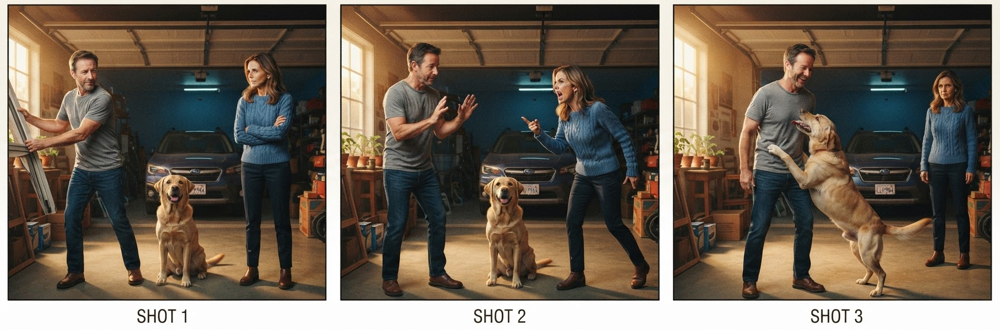
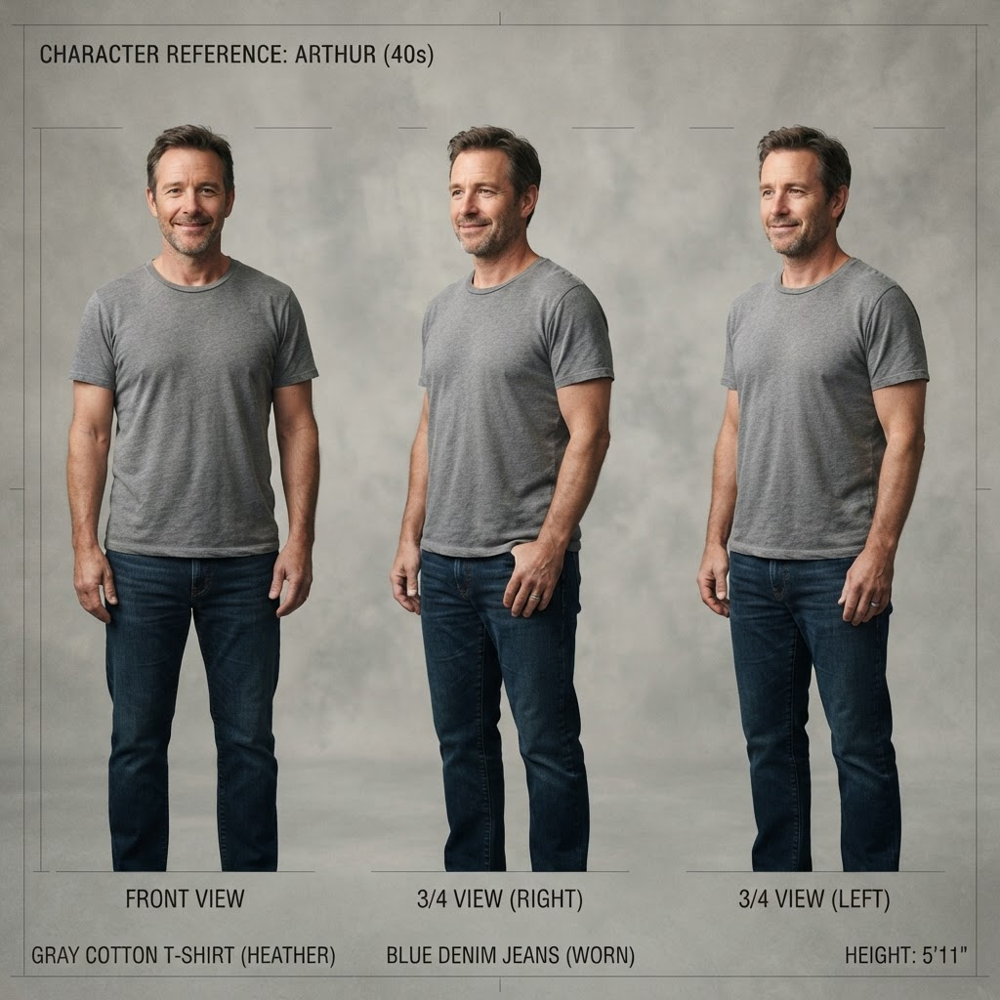
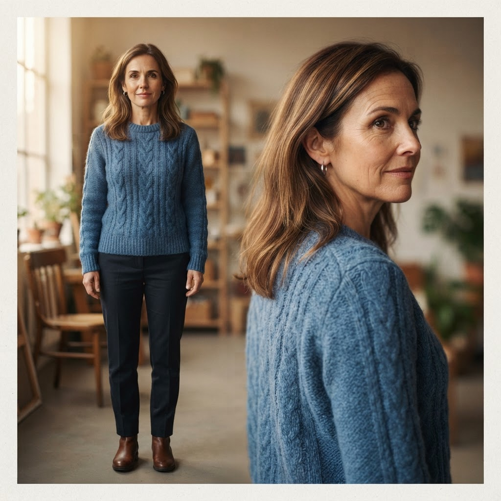
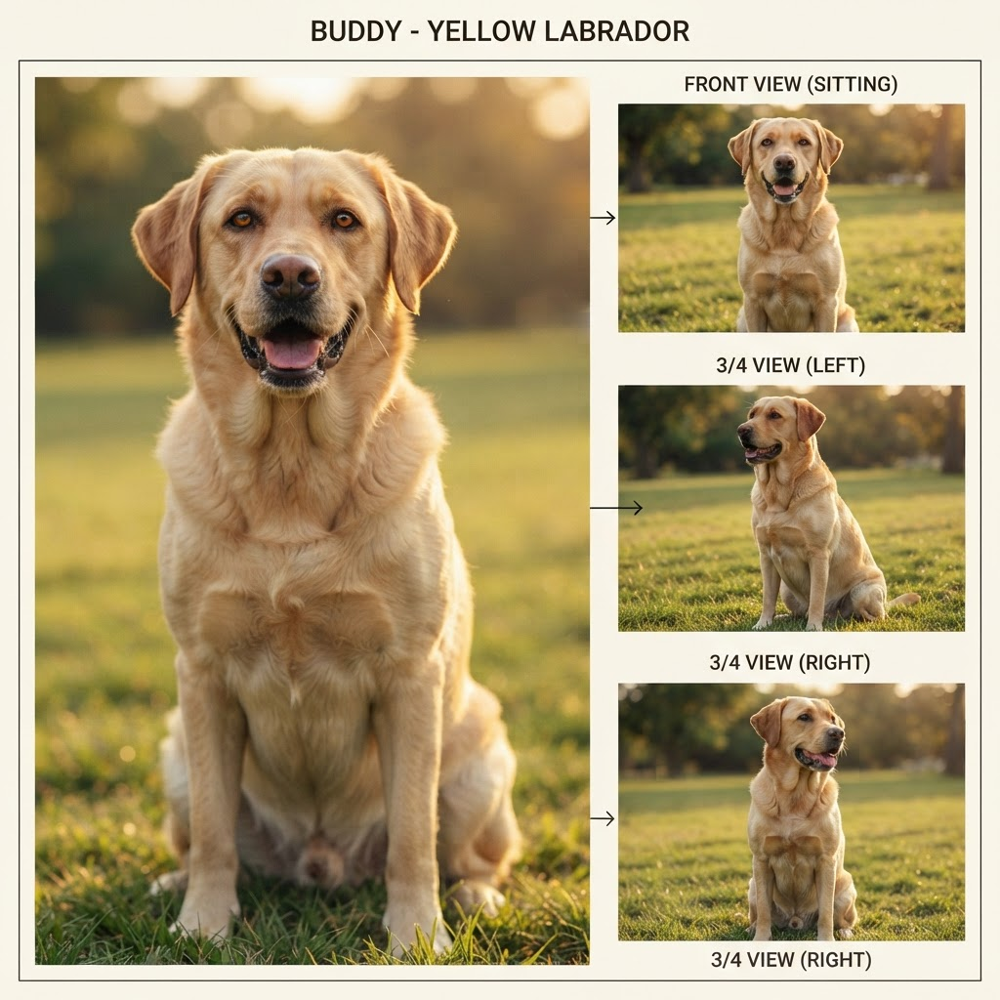

# Part 3 · Consistency Is the Product

*Part 3 of **[The Agentic Studio](agentic-studio-series.md)**. Anyone can generate a clip. The moat
is making a thousand clips that agree — on a face, a set, a light, a line of action — and doing it
cheaply enough that the marginal scene approaches free. This part is about the invariants that are
hard on purpose, and the unit economics that follow from getting them right.*

---

## The moat is an invariant, not a model

Part 1 argued the render function is being commoditized; Part 2 built the scheduler around it. The
open question is where defensibility lives once every competitor can call the same generator. The
answer is the thing a raw generator structurally cannot give you:

> **Cross-asset consistency. A generator optimizes each output independently; a studio optimizes the
> *agreement* between outputs. That agreement is enforced by state and validation the model never
> sees — which is exactly why a better model doesn't erase the moat, it feeds it.**

Three invariants carry the weight. Each is a concrete engineering problem with a concrete mechanism,
and each gets harder — not easier — as the render function improves, because a sharper render makes an
inconsistency *more* obvious, not less.



*What "the product" looks like: three framings of one scene where identity, continuity, and the world
all hold. No single render gives you this — it's the invariants below, enforced together.*

## Invariant 1 — Identity across shots

The identity anchors from ***The Choice*** — one canonical reference sheet per character, re-fed into
every shot so the same face/wardrobe survives the whole film:

<div class="gallery">
<figure><figcaption>Arthur</figcaption></figure>
<figure><figcaption>Martha</figcaption></figure>
<figure><figcaption>Buddy</figcaption></figure>
</div>

**The problem.** The same character must read as one person across dozens of shots, at different
angles, distances, and lighting, when every render is an independent stochastic draw. Prompt the same
description twice and you get two different people — imagine a film where the lead is quietly recast
with a new look-alike in every single scene. That's the default behavior you're fighting.

**The mechanism.** Cast once, then condition every render on a **canonical reference sheet** — a
front + 3/4 view generated at project start and stored in the bible. Keyframes are composed *from*
those sheets, not re-described from text. And critically, composition adds **one character at a time**
(≤2 reference images per model call) starting from the styled empty set plate: pass a crowd of
references at once and the model drops or invents people. The constraint is counterintuitive and it is
load-bearing — resist the urge to "optimize" it into a single multi-reference call.

**The judge.** A vision critic scores identity *against the reference sheets*, not against a vague
notion of "a person." A single-image check literally cannot tell "the same character" from "a
character"; the reference is what makes the score mean something.


*The reference sheet is both the input to every render and the yardstick the critic judges it by.
"Does this look like her?" only has an answer because there is a canonical *her* to compare to.*

## Invariant 2 — Continuity across scenes

The same cast, consistent across different scenes of ***The Choice*** — same identities, look and
world, scene to scene:

<div class="gallery">
<figure><video controls preload="metadata" src="media/choice-scene-2.mp4"></video><figcaption>Scene 2</figcaption></figure>
<figure><video controls preload="metadata" src="media/choice-scene-3.mp4"></video><figcaption>Scene 3</figcaption></figure>
</div>

**The problem.** Screen direction, eyelines, the 180° line, lens family, and shot-to-shot angle
deltas must hold across cuts, or the audience feels the space break even if every individual frame is
beautiful. These are the famous blooper-reel gaffes — the coffee cup that appears mid-scene, the
actor looking the wrong way after a cut so two people seem to trade seats. This is not a matter of
taste; it is a set of rules professional script supervisors enforce on set precisely because they are
easy, invisible mistakes to make.

**The mechanism.** Before anything is drawn, the director doesn't produce pixels — it produces a
**shot plan**: a small table describing each shot as *numbers and labels* (who the subject is, which
side of the frame they're on, which way they face, the camera angle in degrees, the lens). Those
numbers are all you need to *check* the rules, so a plain function — no AI, no rendering, just logic —
reads the plan and flags anything that breaks film grammar:

- **establish-first** — open on a wide shot before cutting to close-ups of a space;
- **the 180° line** — a character who's on screen-left mustn't jump to screen-right between shots (or
  the two people appear to swap seats);
- **eyeline match** — if A looks screen-right at B, the reverse shot must frame B from the matching
  side, so their gazes actually meet;
- **the 30° rule** — move the camera at least 30° between two shots of the same subject, or the cut
  looks like a glitchy "jump";
- plus a couple more (over-the-shoulder pairs shot at matching heights; one lens family per scene).

Each thing it finds is tagged **error** (a real continuity break — must fix) or **warning** (a
stylistic nudge — allowed). The plan is saved and sent to render **only if there are zero errors**.

The reason to check the *numbers* first: reading a small table is instant and free (microseconds of
CPU), while rendering a frame is slow and costs real GPU money. So you catch the mistake on the cheap
artifact — the plan — instead of paying to generate a shot you'd only throw away.

**Why deterministic.** Continuity is *provable* — you can check the 180° line with arithmetic. Using
an LLM for what a rule can prove is slower, costlier, and less reliable. Save the model's judgment for
what is genuinely subjective.

## Invariant 3 — Cross-domain compositing

**The problem.** Some shots fuse distinct visual domains that must read as one photograph — the
running example: a painted galaxy at optical infinity over a sharp, night-lit town. Get it wrong and
the sky looks glued on, the single most common tell of amateur compositing. Think of a TV weather
presenter whose lighting doesn't match the map projected behind them: your eye flags the fake
instantly, even if you can't name what's off. A generated galaxy floating over a generated town fails
in exactly the same way — two layers that never agreed on where the light comes from.

**The mechanism.** A **single global style anchor** both domains derive from, locking one color
temperature, one grain, one palette across the cosmic and terrestrial layers. Then extend the critic
with a **lighting-coherence dimension**: does the sky's light direction and color temperature match
the ground's? This is a judgment a rule can't express and a single-frame glance can't catch — exactly
the critic's job. (It also motivates extending the continuity validator with a *gaze-to-environment*
rule: when a character looks up at the galaxy, the gaze vector must agree with where the galaxy is
framed across cuts — an eyeline match where one participant is a set, not a person.)

## The loop that enforces all three

Invariants are only real if something checks them and something fixes them. The studio runs a bounded
correction loop on every render:

```
render → critic scores vs reference sheets + style anchor
       → if pass: persist (qc_ok, qc_score) to the bible
       → if fail: feed the critic's ISSUES back into the prompt, re-render
       → repeat up to QC_MAX_TRIES, then escalate to the human
```

Two properties make it production-grade rather than a demo. It is **bounded** — a fixed retry ceiling,
like a shoot with a limited number of takes, so a pathological prompt can't burn the budget. And it is
**corrective, not blind** — the next attempt receives the critic's specific issues ("second character
missing," "eyeline reversed"), not a fresh reroll of the dice. Blind retries converge slowly if at
all; issue-directed retries converge fast.

## The unit economics that follow

Consistency is the product; economics is why the product wins. Decompose a scene's cost:

- **Deterministic gate: effectively free.** Validation is CPU-microseconds and catches the errors
  that would otherwise cost a wasted render. It is *negative* cost — it pays for itself by not
  rendering bad plans.
- **Render + QC: a small multiple of one image.** Cost is `attempts × per-image`, with `attempts`
  bounded by `QC_MAX_TRIES` (default 2) and usually 1. The critic adds one cheap vision call per
  attempt. Call it low single-digit image-charges per keyframe.
- **Video: the expensive tier, and gated.** Motion is minutes of async work and dollars per clip, so
  it runs **only on explicit request, after the keyframe is approved** — never speculatively. You pay
  for motion once you already like the frame.

The shape that matters: the pipeline **pushes the cheap, correct checks upstream and the expensive,
stochastic work downstream, behind gates.** A defect is caught by arithmetic before it becomes a
render, and by a critic before it becomes a video. That ordering is what drives the marginal cost of an
*acceptable* scene down — not the sticker price of a single generation, but the amortized cost of a
scene that actually passes.

> **The naive cost of a scene is one render. The real cost is the number of renders until one is
> good. The studio's entire job is to make that number small — cheap gate first, directed retries
> second, expensive motion last and only on demand.**

## Where it goes

The same skeleton — typed state, dependency order, deterministic gate, critic loop, links-not-bytes —
generalizes past keyframes:

- **Video and sound as the same pipeline.** Motion and score are additional stages behind the same
  bible and the same gates. Async job names live in state; any instance rehydrates and polls them. The
  architecture doesn't change shape when the assets get heavier — it just adds tiers.
- **Human-in-the-loop as direction, not babysitting.** The interactive mode stops at meaningful
  creative gates — approve the cast, approve the scenes, approve a keyframe — and the autonomous mode
  runs straight through. The human is a director giving notes, not an operator clicking through every
  step. The critic loop is what earns that trust: the system fixes its own obvious mistakes before
  asking.

## The series, closed

- **[Part 1 — The Studio Is a Distributed System](part-1-thesis.md):** why the moat is the
  orchestration layer, not the render function.
- **[Part 2 — Barrier, Fan-out, Join](pre-production-barrier.md):** the architecture that produces
  the artifacts these invariants defend.
- **Part 3 — this one:** the invariants themselves, the loop that enforces them, and the economics
  that make consistency cheap.

The whole thesis in one line: **the render function makes a frame; the studio makes a frame agree with
the thousand around it — and that agreement, enforced by state the model never sees, is the product.**

---

*Built on a real MCP + Skills film-production pipeline. Foundations: **[MCP and Skills](mcp-and-skills.md)**.*
