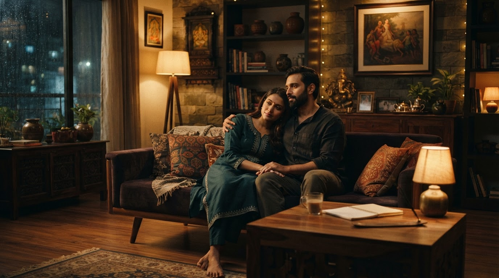
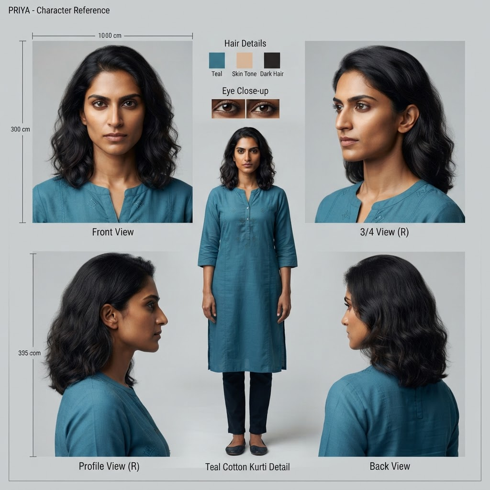

# Part 2 · Barrier, Fan-out, Join — the architecture of a creative agent

*Part 2 of **[The Agentic Studio](agentic-studio-series.md)**. The studio is a scheduler over
stochastic renders; this is how the scheduler is built. One decision dominates the design, and it
happens **before any GPU-second is spent**: a short, strictly ordered barrier — treatment, look,
cast — that every downstream branch conditions on. Lock it and N scenes fan out in parallel, cheaply
and safely. Skip it and you pay for the same inconsistency N times over. The pipeline is a real MCP
server; every claim below is a mechanism, not a metaphor.*

---

# The five-minute version (for architects)

## The one idea

> **In an agent system, the expensive failures come from fanning out before you've locked the
> context every branch shares. The job of the architect is to find that shared context, produce it
> as a few cheap artifacts in a fixed order, gate it — and only then parallelize.**

A film crew figured this out a century ago. Nobody shoots a single frame until the script is locked,
the look is set, and the cast is fixed. That "pre-production" phase is cheap (it's mostly talk and a
few reference images) and it is **sequential on purpose**. Principal photography — the expensive part
— only begins once those decisions can no longer move underneath everyone.

That is exactly the shape of a well-built agent pipeline. And most teams get it backwards: they
parallelize the expensive generative calls first because that's where the latency is, then spend
their real budget re-doing work because each parallel branch made a different assumption about the
shared context.

## The shape

```
PRE-PRODUCTION  (sequential barrier — cheap, gated)
   idea → treatment → style anchor → full cast
                 │  everything below conditions on these
                 ▼
PHOTOGRAPHY     (fan-out — expensive, parallel, independent)
   scene 1 ┐
   scene 2 ├─ establish → plan → validate → render → QC   (all at once)
   scene 3 ┘
                 │
                 ▼
POST            (sequential join)
   assemble → (video, score)
```

Three phases, and the boundaries aren't arbitrary — the film schedule tells you exactly where they
go. Pre-production is a **barrier**: nothing downstream may start until it's done. Photography is a
**fan-out**: once the look and cast are locked, scenes are independent and render concurrently (a
"second unit"). Post is a **join**.

## Why the barrier is load-bearing (the cost math)

The barrier is a handful of *cheap* artifacts. A treatment is text. A style anchor is one image. A
cast is a few reference images. Call it single-digit dollars and a few seconds.

The fan-out is where the money is: every scene, every shot, every re-render, every QC pass, times N
scenes running in parallel. That's where 95% of the cost and latency live.

Here's the leverage. **A defect introduced in the barrier is multiplied by the entire fan-out.** If
the style anchor is inconsistent, every one of the N parallel scenes inherits a look that doesn't
match — and you re-render all N. If a character's reference sheet is ambiguous, every shot that
character appears in comes back wrong. The cheapest artifact in the system is also the one with the
largest blast radius.

So the rule writes itself:

> **Spend your reliability budget on the cheap, sequential, upstream artifacts — because they are
> the ones the expensive parallel work multiplies.**

This is why pre-production is gated with a human approval (or a validator) and photography is not.
You stop and confirm the four things that everything depends on. After that, you let it run.

## What generalizes beyond film

This isn't about movies. Any agent workflow that fans out has a pre-production barrier hiding in it:

- **A coding agent** refactoring 40 files: the barrier is the plan + the shared conventions +
  the target API. Lock those, then edit files in parallel. Skip the barrier and you get 40 files
  that each invented their own version of the interface.
- **A research agent** writing a report: the barrier is the question decomposition + the source
  list + the claim schema. Then fan out the reads.
- **A data pipeline agent**: the barrier is the schema + the validation rules. Then process
  partitions in parallel.

The discipline is identical: **find the shared context, produce it cheaply and in order, gate it,
then parallelize.** If you can't name your barrier, you don't have an architecture — you have a
prompt and some hope.

---

# The field report (for builders)

Everything below is real code from the pipeline. Two servers, one of them (`movie-mcp`) a
multi-module film-production app. The bible — a per-user, per-project JSON document — is the source
of truth; each stage reads the previous stage's artifact from it, never from chat history. That
detail matters: **the handoff artifact, not the conversation, is the interface between stages.**

## The crew → code mapping

Model the roles, and the agents, artifacts, and guardrails fall out of the org chart:

| Film role | Owns | Code | Artifact produced | Guardrail |
|---|---|---|---|---|
| Screenwriter | idea → script | `script-developer` skill (text only, cheap) | `Treatment{logline, scenes[], cast[]}` | — |
| Production designer | the "look" | `generate_style_ref` + `establish_scene` | `StyleRef`, `ScenePlate` | style anchor |
| Casting / char design | identity consistency | `add_character` | `CharacterSheet{ref_uri}` | QC vs refs |
| Director | blocking, shot choice | `film-director` skill | `ShotPlan` | — |
| Cinematographer | lens, framing, light | prompt fields + lens rule | shot params | `film_grammar` R19 |
| **Script supervisor** | eyelines, 180° line | **`film_grammar.validate_plan`** | violations | R1/R3/R4/R7/R14 |
| Editor / QC | dailies, reshoots | `film-editor` skill + `review_image` | `Dailies{qc_score, issues}` | critic + `QC_MAX_TRIES` |
| Composer | score | `musicgen` | audio | — |

*Those rule codes in plain English:* the **180° line** (R1) keeps the camera on one side of the
imaginary line between two characters so they don't swap sides on a cut; an **eyeline match** (R3)
makes sure that when A looks at B, the next shot frames B from the direction A was looking;
**establish-first** (R7) means you show the room before you cut into close-ups of it; the **30° rule**
(R4) avoids a jarring "jump cut" by moving the camera at least 30° between two shots of the same
subject. Each is something a human script supervisor watches for on set — and each reduces to an
arithmetic check on the shot-plan numbers, which is the whole reason `film_grammar` can enforce them.

Two of these mappings carry the whole design:

- The **script supervisor is deterministic code.** Continuity is *rules*, not taste. The 180° line,
  eyeline match, the 30° jump-cut rule, establish-first — these are checkable. `film_grammar` is
  pure logic, no I/O, and `plan_scene` **persists shots only if there are zero `error`-severity
  violations.** A cheap deterministic gate before you ever spend a render.
- The **editor is an LLM critic loop.** "Does this character look like the reference? Is the sky's
  light matching the ground's?" is *judgment*. `review_image` scores per dimension against the
  reference sheets, and on failure the pipeline **regenerates with the critic's `issues` fed back
  into the prompt**, up to `QC_MAX_TRIES` (default 2) — like a shoot with a limited number of takes.

That split — **deterministic gate for rules, LLM critic for judgment** — is the reliability backbone.
Don't use a model for what a rule can check; don't use a rule for what needs taste.

## The barrier in code

The line producer's call sheet is *logistics*, not creativity. So the **order** is plain code; the
**craft** inside each step is an LLM agent with a skill. Pseudocode of the real pipeline:

```python
# PRE-PRODUCTION — sequential barrier. No LLM decides the ORDER.
treatment = await screenwriter(idea)                    # text, cheap
style     = await production_designer(treatment.style)  # ONE anchor — global look
cast      = await parallel(add_character(c) for c in treatment.cast)
#           ^ characters are independent of each other, but ALL of them gate photography

# ---- BARRIER ----  (human approval in INTERACTIVE mode; validator otherwise)

# PHOTOGRAPHY — fan-out. Scenes are independent now that look + cast are locked.
async def shoot(scene):
    plate = await establish_scene(scene, style)         # persistent, people-free set plate
    plan  = await director(scene, cast)                 # CRAFT: judgment
    errs  = film_grammar.validate_plan(plan)            # CONTINUITY: deterministic gate
    if errs:
        plan = await director.fix(plan, errs)           # re-block, don't reshoot
    return await render_with_qc(plan, refs=[style, *cast])   # EDITOR: critic loop

dailies = await parallel(shoot(s) for s in treatment.scenes)  # second unit
```

Note what's sequential and what's parallel. Casting fans out *within* the barrier (characters don't
depend on each other) but the barrier as a whole still blocks photography (every scene needs the
whole cast + the look). Scenes fan out *after* the barrier because they're genuinely independent.
The concurrency graph isn't a guess — it's the dependency structure of the artifacts.

## How the skills and MCP tools are actually called

The pseudocode above hides the two things doing the work: `screenwriter()` and `director()` are not
functions — they're the **LLM following a Skill**, and `plan_scene`/`generate_shot` are **MCP tool
calls over the wire.** These are two completely different mechanisms, and understanding the
difference is the difference between a demo and a system.

One ADK agent registers **both** as tools:

```python
from google.adk.skills import load_skill_from_dir
from google.adk.tools import skill_toolset
from google.adk.tools.mcp_tool import McpToolset, StreamableHTTPConnectionParams

skills     = [load_skill_from_dir(SKILLS / n)            # know-how, in-process
              for n in ("script-developer", "film-director", "film-editor")]
movie_tools = McpToolset(connection_params=StreamableHTTPConnectionParams(
                 url=MCP_URL, timeout=180.0))            # capability, over HTTP

root_agent = Agent(name="movie_director", model="gemini-3.5-flash",
                   tools=[skill_toolset.SkillToolset(skills=skills), movie_tools])
```

- A **Skill loads into the agent's own runtime** — no network. It's *know-how*: the director's
  decision procedure, the continuity rules, the shot patterns. It's delivered by **progressive
  disclosure** so it doesn't sit in context all the time: **L1** (name + description) is always
  resident so the model knows the skill exists; **L2** (the `SKILL.md` body) loads only when the
  task triggers it; **L3** (bulky reference files like `references/continuity-rules.md`) loads only
  when the workflow actually reaches for it.
- An **MCP tool call goes over Streamable HTTP** to a separate process — the credentialed
  *capability*. The agent negotiates the connection once (`initialize` → `tools/list`), then each
  call is a `tools/call`. The 180s timeout is deliberate: image gen is ~12s and video is minutes,
  well past ADK's 5s default.

Here's a single scene flowing through both, end to end:

```mermaid
sequenceDiagram
    autonumber
    actor U as User
    participant H as Agent (Gemini LLM)
    participant SK as Skills runtime<br/>(SkillToolset, in-agent)
    participant S as movie-mcp<br/>(over Streamable HTTP)
    participant G as film_grammar<br/>(deterministic)
    participant NB as nano-banana<br/>(Vertex AI)
    participant B as Bible<br/>(per-user JSON)

    rect rgb(244,247,252)
    Note over H,S: Wire-up once — MCP handshake; Skills L1 metadata resident
    H->>S: initialize + tools/list
    S-->>H: tool schemas (plan_scene, generate_shot, …)
    Note over H,SK: L1: skill names/descriptions already in context
    end

    U->>H: "Shoot scene 3 — the kid looks up at the galaxy"

    rect rgb(245,244,252)
    Note over H,SK: KNOW-HOW loads in-process (no network) — progressive disclosure
    H->>SK: load_skill film-director [L2 workflow]
    SK-->>H: decision procedure (coverage, camera, anchors)
    opt rules needed
        H->>SK: load_skill_resource continuity-rules.md [L3]
        SK-->>H: [ENFORCED] rule list (R1/R3/R4/R7/R14/R19)
    end
    Note over H: LLM emits a ShotPlan JSON per the skill
    end

    rect rgb(244,252,244)
    Note over H,B: CAPABILITY over the wire — validated, then rendered
    H->>S: tools/call plan_scene(ShotPlan)
    S->>G: validate_plan(plan)
    alt zero error-severity violations
        G-->>S: [] (warns allowed)
        S->>B: persist shots
        S-->>H: {scene_id, shots}
        H->>S: tools/call generate_shot(scene_id, shot_id)
        S->>NB: compose from style plate + character refs
        NB-->>S: PNG bytes
        S->>B: save + qc_ok/qc_score
        S-->>H: resource_uri movie://… (a link, NOT bytes)
    else has error violations
        G-->>S: [R1 line cross, R3 eyeline, …]
        S-->>H: rejected + violations
        Note over H: re-block via skill, resend — no frame was rendered
    end
    end

    H->>S: resources/read movie://… (bytes on demand only)
    S-->>H: PNG bytes
    H-->>U: "Scene 3 keyframe: movie://…"
```

Read the diagram as three bands. The **blue** band happens once — the MCP handshake, and Skill L1
metadata that's always resident. The **purple** band is know-how loading *inside the agent* with no
network hop (L2, then L3 only if the rules are needed). The **green** band is the capability going
*over the wire* — and notice the deterministic gate sits **inside the server**, before any pixels:
`plan_scene` calls `film_grammar.validate_plan` and only a clean plan gets persisted and rendered. A
plan with an error-severity violation bounces back with the reasons, the agent re-blocks via the
skill, and **no render was spent.** Finally, bytes cross the wire only on the explicit
`resources/read` — the link-not-bytes rule the whole economics depends on.

The one sentence to keep: **Skills answer "how should I do this?" in the agent's head; MCP answers
"do this for me" in another process.** They compose in a single agent, and the barrier from Part 1
is just this sequence run first for the treatment, look, and cast — the artifacts every later run of
this same sequence conditions on.

## The barrier, then the fan-out — the whole pipeline in one picture

Zoom out from the single scene. The pipeline is the *same* skill+MCP sequence run several times: a
few times **in series** to build the barrier (the shared artifacts), then N times **in parallel**
once the barrier is locked. The `par` band below is where the money is spent — and it's only safe to
run in parallel *because* everything above the barrier line already agreed on the look and the cast.

```mermaid
sequenceDiagram
    autonumber
    actor U as User
    participant H as Agent (Gemini LLM)
    participant SK as Skills runtime
    participant S as movie-mcp
    participant G as film_grammar
    participant NB as nano-banana
    participant B as Bible

    U->>H: "Galaxy over a remote town — a kid who wants the stars"

    rect rgb(245,244,252)
    Note over H,B: PRE-PRODUCTION — sequential barrier (cheap: text + a few anchors)
    H->>SK: load_skill("script-developer")
    SK-->>H: clarify + treatment procedure
    Note over H: LLM emits Treatment{logline, scenes[], cast[]}
    H->>S: create_project
    S->>B: write bible → project_id
    H->>S: generate_style_ref
    S->>NB: ONE global look anchor (town night + galaxy palette)
    NB-->>S: PNG
    S->>B: StyleRef
    loop each character in cast
        H->>S: add_character
        S->>NB: reference sheet
        S->>B: CharacterSheet{ref_uri} (+ QC)
    end
    end

    Note over H,B: ── BARRIER ── approve look + cast (INTERACTIVE) / validate (AUTO)

    rect rgb(244,252,244)
    Note over H,B: PHOTOGRAPHY — fan-out; scenes independent now (second unit)
    par scene 1
        H->>S: establish_scene → plan_scene
        S->>G: validate_plan
        G-->>S: [] ok
        S->>NB: generate_shot (from plate + refs)
        S->>B: shot + resource_uri
    and scene 2
        H->>S: establish_scene → plan_scene
        S->>G: validate_plan
        G-->>S: [R3 eyeline] ← gaze-to-galaxy
        Note over H: re-block via skill, resend (no render spent)
        S->>NB: generate_shot
        S->>B: shot + resource_uri
    and scene 3
        H->>S: establish_scene → plan_scene → generate_shot
        S->>B: shot + resource_uri
    end
    end

    rect rgb(244,247,252)
    Note over H,B: POST — sequential join
    H->>S: list_project_assets
    S-->>H: ResourceLinks (movie://…)
    H-->>U: dailies — one keyframe per scene
    end
```

Three things this picture makes obvious that the prose can't:

- **The barrier is short and cheap** (one purple band, a handful of calls) but **everything in the
  green band sits below it.** The blast-radius argument from Part 1 is now literally the vertical
  layout: a bad `StyleRef` poisons all three parallel branches.
- **`par` is only legal after the barrier.** Scene 2 and scene 3 don't reference each other — they
  reference the *same* `StyleRef` and cast produced above. Remove the barrier and `par` becomes a
  race: three scenes inventing three looks.
- **The gate lives inside each branch, cheaply.** Scene 2's `plan_scene` fails `validate_plan`
  (the kid's gaze doesn't match where the galaxy is framed — the eyeline-to-environment case), the
  agent re-blocks via the skill, and **no frame was rendered** for the rejected plan. Deterministic
  gate before the expensive call, per branch.

## What the pipeline actually produces

Abstract enough. Here are real artifacts from a single run, in pipeline order — the same
barrier-then-fan-out you just read, rendered.

**1. The style anchor** (`generate_style_ref`) — one image that fixes the world's look: palette,
light, texture. Everything downstream is composed to match it.



**2. The character sheet** (`add_character`) — the identity anchor, generated once and reused in every
shot the character appears in. This is what stops the "recast every scene" problem.



**3. The set plate** (`establish_scene`) — the people-free room, lit and dressed. It's rendered once
per scene and every shot in that scene is composed on top of it, so the space stays put.


**4. The micro-shot** (`plan_scene` → `generate_shot`) — the scene's coverage, validated for
continuity, then rendered. Notice the payoff of stages 1–3: the *same* two characters, the *same*
set, consistent screen direction, across three different framings.


That last frame is the whole architecture cashing out: identity from the sheet, world from the style
anchor, space from the set plate, continuity from the validator — composed into shots that agree.

## Why the anchor is a single call, on purpose

`generate_style_ref` produces **one** global look anchor, and every character and scene is composed
*from* it. This is the barrier doing its job: it's the shared context that keeps N parallel branches
in one visual world. Skip it — let each scene invent its own palette — and you've traded a barrier
for a merge conflict you can only resolve by re-rendering everything.

The same discipline shows up one level down. Keyframe composition edits in **one character at a
time** (≤2 reference images per model call) starting from the styled empty set plate. Passing many
references at once makes the model drop or invent characters. That's a barrier-within-a-shot: lock
the plate, then add subjects sequentially against it.

## The economics that make the fan-out affordable

None of this scales if the artifacts are heavy. They aren't — because tools return **links, not
bytes.** An image tool saves the PNG server-side and returns a tiny record with a `resource_uri`
(`movie://user/project/name`); pixels only cross into the model's context on an explicit
`resources/read`. So the barrier's artifacts are cheap to pass to every one of the N parallel
branches. Inline the base64 instead and you'd put megabytes into context on every call — the fan-out
would collapse under its own token weight. **Context economics is what makes the topology viable.**

## The takeaway

The image model was the easy part. The architecture was recognizing that a film crew is already a
multi-agent system — division of labor by craft, communicating through durable artifacts, gated at
the one place it matters. The roles give you the agents. The handoff artifacts give you the
interfaces. The production phases give you the concurrency graph. And the pre-production barrier —
cheap, sequential, gated — gives you the one decision that determines whether the expensive part
runs once or N times.

> **Model the crew, not the movie. Then find your barrier before you fan out.**
